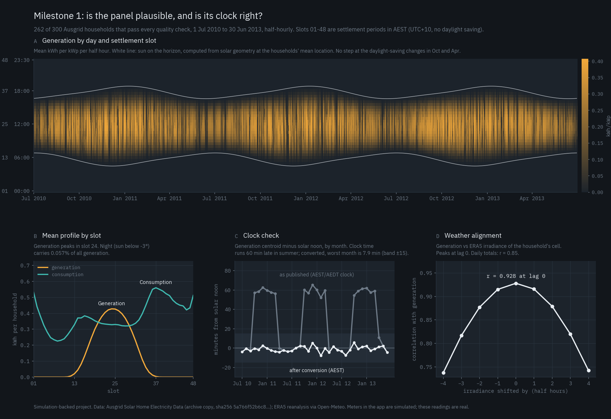

# Local Energy Market

A peer-to-peer market for one residential LV feeder. Households with rooftop
solar sell surplus to their neighbours instead of exporting it to the utility.
The book clears every half hour at a single uniform price, strictly inside the
band between the feed-in and retail tariffs. Every slot is committed before
delivery and settled against cryptographically signed meter readings, then
anchored on chain, so the operator cannot restate an outcome afterwards.

**This is simulation-backed on real data.** There is no physical microgrid.
Meters are simulated processes holding real ECDSA keys. Load and generation
come from the Ausgrid *Solar Home Electricity Data* set (Sydney, 2010–13);
weather comes from Open-Meteo (ERA5). Prices are in rupees against an Indian
tariff band applied to Australian households. The interface says all of this in
its footer and on its Method page.



---

## Run it

Needs Python 3.11 and Node 18+. [Foundry](https://book.getfoundry.sh) is
optional: with it, every slot is also anchored on a local Anvil chain.

```bash
python3.11 -m venv .venv
.venv/bin/pip install -r sim/requirements.txt pytest==8.3.4    # Windows: .venv\Scripts\pip ...
.venv/bin/python demo.py                                         # Windows: .venv\Scripts\python demo.py
```

`demo.py` builds the data panel on first run (downloads ~57 MB), starts Anvil
and deploys the contracts if Foundry is installed, starts the market engine on
:8000 and the website on :3000. Open http://localhost:3000. `--no-chain` skips
the chain, `--prod` serves a production build. `make demo` does the same on Unix.

## What the website shows

| Page | What it is for |
|---|---|
| **Control room** `/` | The 48-slot settlement ruler, the feeder mimic (each trade animates as a pulse from seller to buyer that thins by its loss), the cleared and open books, today's totals against grid-only billing. Clock controls: pause, step, speed, jump to any day Oct 2012 – Mar 2013. |
| **Trade** `/trade` | Act for any household: *Sell surplus* or *Buy energy* in any open slot. Your order replaces that household's agent. Outcomes, including imbalance, are settled against its signed meter. |
| **Households** `/households/[id]` | Forecast vs contract vs signed meter reading per slot; market, imbalance and counterfactual cash; the meter's registered key. |
| **Settlement** `/settlement/[g]` | The evidence for one slot: commitment, trades, 24 signed readings, the two-pass settlement, money conservation, the on-chain transactions. *Verify in this browser* recomputes the hash and recovers every signature with viem, independently of the engine. |
| **Method** `/method` | What is real, what is simulated, what is not built, and where each model stops being accurate. |

## How it works

```
 orders ──► web API route ──► Python engine ──────────────► EnergyMarket.sol
            band check 1      band check 2                  band check 3
                              uniform-price auction          verify commitment
                              flows + I²R losses             recover 24 signatures
                              keccak256(trades) → commit ──► commit(slot, hash)
                              meters sign readings           two-pass settlement
                              two-pass settlement ─────────► settle(...) → events
                              (Python and chain must agree; the client checks)
```

- **Matching is off-chain, settlement is on-chain.** The contract never walks an
  order book; it checks that settled quantities match the commitment and what
  the meters signed.
- **Commit before settle.** keccak256 of the cleared trades is published at gate
  closure, before any meter reports. A restated trade fails the check, in Python,
  in the browser and in the contract (all three are tested).
- **The oracle problem is relocated, not solved.** The contract verifies which key
  signed a reading, not that the reading is true. See the NatSpec in
  `contracts/src/EnergyMarket.sol`.
- **Two-pass settlement.** Pass 1 pays the cleared price on contracted energy.
  Pass 2 settles each household's deviation from its contract at grid tariffs
  (short pays retail, long gets feed-in). Every saving is measured against
  billing the same readings with no market. Money is integer milli-paise, so
  conservation is exact.
- **Losses.** I²R on the service and backbone conductors along each trade's path,
  capped at 5%. On this feeder they come to 0.1–0.6% per trade; the model's limits
  (no load flow, voltage, thermal or phase effects) are documented in
  `market/losses.py`.

## Repository

```
ml/            data pipeline: Ausgrid + ERA5 -> tidy UTC panel, quality flags, sanity figure
market/        pure-Python engine: orders and band, double auction, losses, flows, settlement
sim/           feeder model, agents, meters and signatures, slot state machine, chain client, FastAPI
contracts/     MeterRegistry.sol, EnergyMarket.sol, Foundry tests, Deploy.s.sol
web/           Next.js 14 app: the interface above
config/        market.json: the tariff band, read by Python, TypeScript and the deploy script
demo.py        one command to run everything
```

## Tests

```bash
.venv/bin/python -m pytest ml market sim -q        # 966 tests; chain tests skip without Anvil
cd contracts && forge test                          # 19 tests, incl. Python-generated vectors
cd web && npx tsc --noEmit && npx next lint
```

Property tests check, over hundreds of random books, that the cleared price is
strictly inside the band, that every Wh bought was sold, that nobody trades
worse than their limit, that no crossing orders are left unfilled, and that
settlement money is conserved exactly. Two Solidity tests consume values
produced by the Python code (a commitment and a meter signature), proving the
encodings agree byte for byte.

## Deploying to Polygon Amoy

Needs an operator key funded with Amoy POL.

```bash
cd contracts
forge script script/Deploy.s.sol --rpc-url amoy --broadcast --private-key $OPERATOR_KEY --verify
cd .. && LEM_RPC=$AMOY_RPC_URL LEM_OPERATOR_KEY=$OPERATOR_KEY .venv/bin/python -m sim.api
```

The deploy writes `contracts/deployments/80002.json`; the engine registers the
meter keys and anchors every slot from then on. Each settlement costs about
520k gas for 24 signed readings.

## Data provenance

- **Load and generation.** Ausgrid *Solar Home Electricity Data*, 1 Jul 2010 to
  30 Jun 2013 (Ratnam et al. 2017, doi:10.1080/14786451.2015.1100196). Ausgrid
  has withdrawn the download; we use an archive copy kept by Pierre Haessig
  (unaffiliated with Ausgrid), pinned by SHA-256 in `ml/config.py`. The parser
  reproduces Ausgrid's own published annual means and medians to the kWh, and
  the build fails if it ever stops doing so.
- **Weather.** ERA5 reanalysis via the Open-Meteo archive API, one 0.25° cell
  per household. Reanalysis describes the weather as it was, so it is not a
  forecast input. See `ml/data/weather.py`.
- **Time.** Ausgrid's files are in Sydney clock time with daylight saving, but
  every day has 48 columns. `ml/data/preprocess.py` drops the two phantom
  spring-forward periods (always zero), splits the two doubled fall-back
  periods, and checks the result against computed solar noon.

## Status

| Milestone | State |
|---|---|
| 1 Data | Done. Panel, quality flags, sanity figure. |
| 2 Forecasting | Not built. Agents use a seasonal-naive forecast (same slot yesterday) until learned models beat it. |
| 3 Market | Done. Auction, losses, flows, two-pass settlement, property tests. |
| 4 Settlement | Done on a local chain. Amoy deployment needs a funded key (above). |
| 5 Interface | Done. |
| 6 Study | Not built: strategies, wheeling-charge sensitivity, incentive compatibility. |

Known simplifications: the feeder topology is synthetic; 14 of 24 households
have their PV removed so the feeder has buyers at noon; agent prices are seeded
random inside the band; history lives in the engine's memory (no Postgres or
Redis yet). Each is stated on the Method page.
